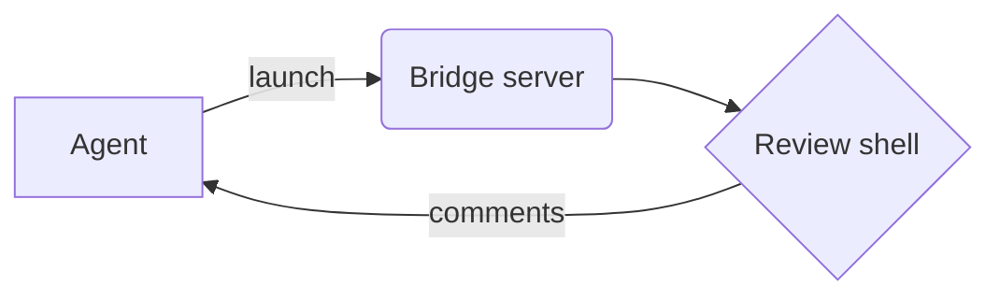

# Sample Markdown

A sample document to exercise the **markdown** preview renderer.

## Features

- Bullet lists
- `inline code`
- [links](https://github.com)

## Table

| Renderer | Mode        |
| -------- | ----------- |
| code     | full / diff |
| markdown | preview     |
| json     | tree        |

## Code block

```python
def hello():
    return "world"
```

## Diagram



> Blockquotes render too. Click any block in preview mode to anchor a comment.
